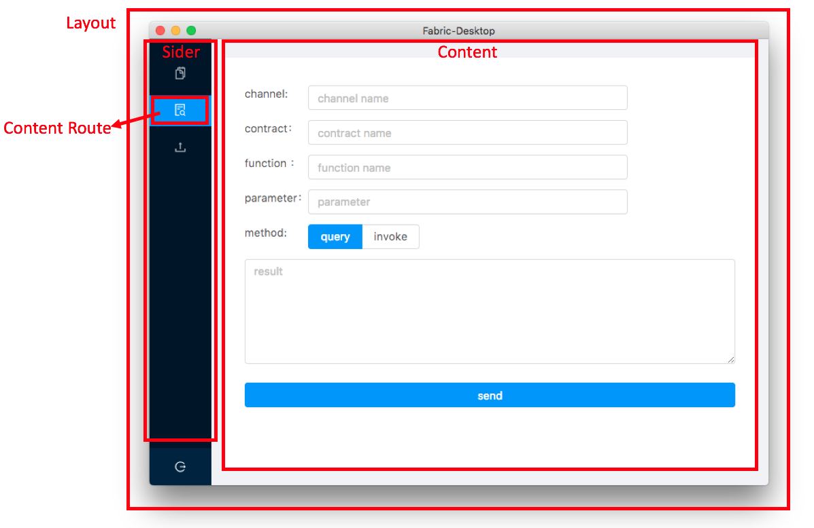
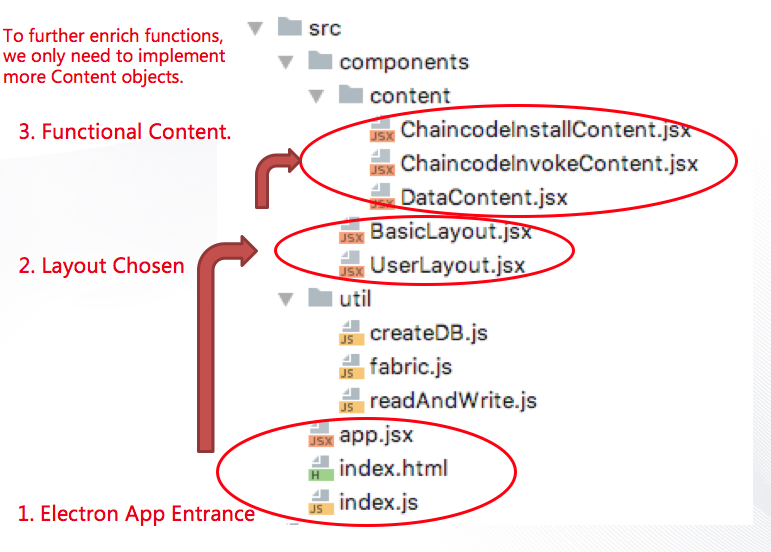

# Hyperledger Fabric Desktop
2018-10-31

## HIP identifier
Hyperledger Fabric Desktop

## Sponsors
* DENG, Yi <michael.yi.deng@gmail.com>
* HUANG, Jishun <874904407@qq.com>
* YANG, Changxin <744919277@qq.com>  
(Alphabetical order)

## Abstract
**Hyperledger Fabric Desktop** is a user-friendly general-purpose cross-platform desktop application,
which help ordinary users to play with Fabric network easily. Its features are as rich as the fabric 
command-line tool, including creating, querying and managing transactions, chaincodes, 
channels, CAs etc. It can be used as a general-purpose application, 
and can also serve as a prototype which help accelerate developing custom applications.
 
## Motivation

Fabric is a permissioned blockchain framework. 
Many industries start to use it to build their own blockchain network alliance.
For those non-IT companies who are not capable to build a system by itself, which is many, they always 
seek outside IT companies to build for them.  

When we provide IT consulting and outsourcing services about blockchain, clients are always confused 
that what is blockchain at all, and how it acts in a real system. They often ask questions such as
"Could you show me something?", "Can I have a try to create a transaction?" etc., before the project
is done or even is started. So, a primitive client tool is needed. 
   
To date, there are some tools that can serve as fabric clients, including fabric command-line tool, 
Hyperledger Explorer, and Hyperledger Cello. We compare these tools as following.  

Tool | Architecture | Features | User-friendly | difficulty of deployment  
--- | --- | --- | --- | --- 
command-line tool | CLI | rich | no | medium 
Hyperledger Explorer | Browser/Server | simple | no | high 
Hyperledger Cello | Browser/Server | medium, but specific | no | high 

To explain this, let's look at command-line tool first...

For Hyperledger Explorer,  ...

For Hyperledger Cello. It aims at blockchain as a service (BaaS). So, it's primary goal is to ...

Many users, who are not developers, want to have hands-on experience to interact with fabric blockchain networks, not just 
looking at the slides, nor the black-window of command-line tools. 

Therefore, after comparing current available tools, we are still not satisfied. We need 
1. **General-purpose**: It should be able to do most common tasks. CLI is ok, but it is too 
awkward to show to ordinary people as it is not GUI.
2. **GUI**: Just like apps we use everyday.
3. **Ordinary-user-friendly**: Ordinary people can deploy and use easily, without the help of engineers. 

Comparing with other available tools, it will be:

Tool | Architecture | Features | User-friendly | difficulty of deployment  
--- | --- | --- | --- | --- 
*Hyperledger Fabric Desktop* | *Desktop Application* | *rich* | *yes* | *low*
command-line tool | CLI | rich | no | medium 
Hyperledger Explorer | Browser/Server | simple | no | high 
Hyperledger Cello | Browser/Server | medium, but specific | no | high 
 
One more thing needed to be mentioned that for those B/S architecture tools such as Explorer and Cello, it
is hard to clarify the worry that a user's private key are kept in servers but not the user's personal computer. 
It means that it is the servers to represent them rather than the users' own computers. 
It also requires another access control mechanism in order to prevent others to act on behalf of the user.  

Desktop can stores the users' private keys in their own computer, so that the users' private keys are hold by 
themselves, rather than in the servers that they cannot control or even cannot understand. 

What is more, the custom distributed-ledger applications are mostly about custom role management and 
transaction flows. There are many features are common for most cases, such as chaincode installation and installation, 
block-info dashboard, CA registration and revocation. 
Most of features are general, such as blockchain dashboard, chaincode installation and deployment etc. 
Some feature are specific, but the desktop also can serve as a prototype. 
   
To sum up, the advantages of a general-purpose desktop are following:
1. Ordinary-user-friendly: It will be a PC-side application, not server-side Application. Ordinary people 
can use it and understand it.
2. Private Keep private keys really private.
3. Serve as a prototype to accelerate developing custom applications. 

## Solution
The desktop will be a wrapper of fabric-node-sdk, and will keep general-purpose at heart. 
In other words, it is a API tool with GUI, but never more. Its scope is:  

1. GUI application 
2. General functions like SDK
3. Prototype client

#### Technology Stack

- **Electron**: A framework for building cross-platform desktop apps with Node.js, JavaScript, HTML, and CSS.
- **React**: A framework for organizing JavaScript, HTML, and CSS, which allows us make great 
object-oriented design. 
- **Ant Design**: A set of high-quality React UI components out of the box.
- **Fabric SDK for Node.js**: A official hyperledger fabric SDK.

#### Architecture Design
Less is more. We emphasize architecture simplicity.

* Main-function Layout Design:  
 

* Code Structure: 

Only 10 source code files compose up the application. We can easily see how the code files map to the 
UI components, such as Layout, Content etc.
It is a pure object-oriented design. Easy to learn and understand. 
To further enrich functions, we only need to implement more `Content` objects.

## Status
Hyperledger Fabric Desktop started in September 2018, and release its first version as v0.1.0 in October 2018.
The source code repository is hosted in Github [here](https://github.com/blockchain-desktop/hyperledger-fabric-desktop).

#### Progress Report
As v0.1.0 version, we already implement features including connection with peers and orderers, chiancode installation and delopyment, 
chaincode query and invocation, and a simple block-info dashboard. It has already could be used to 
demonstrate the workflow of a fabric blockchain network.

#### Roadmap
Recently, we focus on documents, internationalization, and project quality assurence. After these things done, 
maybe before Dec. 2018, we will start v0.2.0 version to implement new features. 
We estimate about 3 or 4-rounds development, we will reach the goal, a full-function general-purpose fabric desktop app.

After that, we only need to maintain the core features to follow the fabric progress. Of course, we 
might try something more interesting after that, such as integrating Blockly to allow ordinary users
to write smart contracts without coding.    

## Effort and Resources
Yonyou Inc. have committed and will still commit consistent effort on this project. 

We design it as simple as possible. We choose tech stack as common as possible. 
so that we can implement it easily, and attract outside contributors easily.
It won't require too much effort and resource to fulfill and maintain this project. 

## How to
- **For ordinary users**: download released software package, and double click to open it as common applications. 
No need to deploy.  
- **For developers**: clone the source code, install Node, run `npm install && npm start`. The dev-mode 
application will show up. 

## Closure
Success Milestone: Implement all the general-purpose functions, 
that fabric-sdk-node provides, as GUI.
